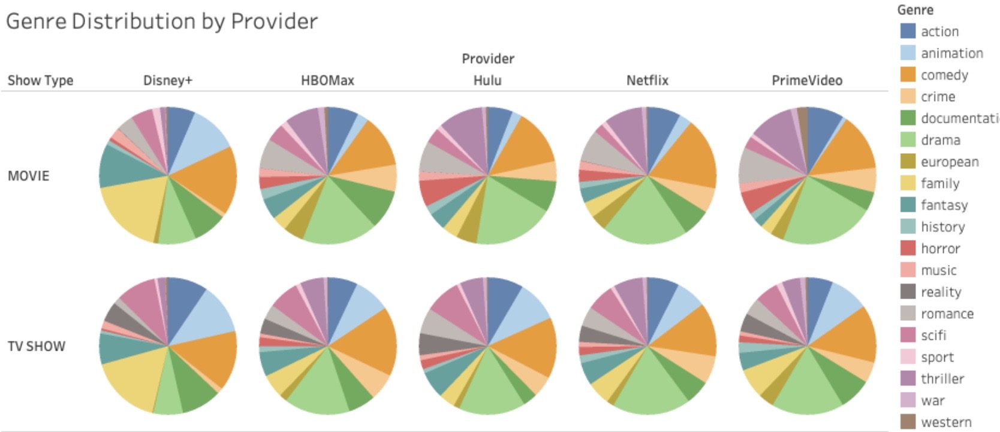
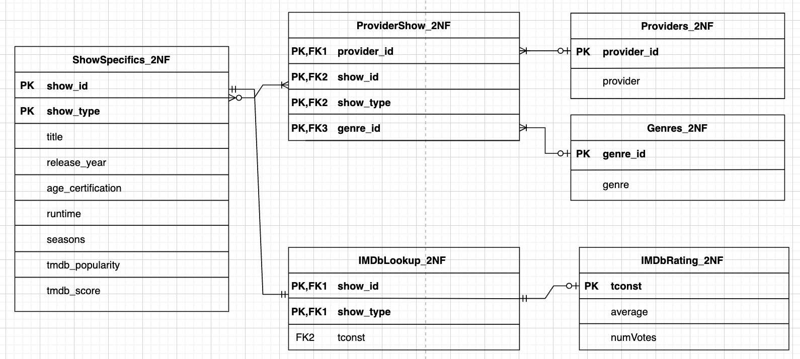

# Streaming Media Analysis

This project investigates the movie and TV shows offered by five popular streaming media providers: Netflix, Hulu, Prime Video, Disney+, and HBO Max. The analysis includes information such as age certifications, ratings, and genres of the shows. The datasets used in this project are sourced from JustWatch.

## Project Overview

The goal of this project is to analyze the streaming media data and provide managerial recommendations from different perspectives, including household consumers, show producers, streaming media providers, and internet service providers. The project involves an initial exploratory data analysis, consolidation into an Excel spreadsheet, data warehousing, preprocessing, normalization in SQL, data visualization in Tableau, and a database schema diagram created using draw.io. Additionally, a video tutorial for creating your own Entity Relationship Diagram in draw.io is attached in /visualizations!

## Database Schema

## Data Sources

The primary data source for this project is JustWatch, which provides datasets containing information about movies and TV shows offered by the streaming media providers. The datasets include details such as show titles, age certifications, ratings, and genres. 

## Tools and Technologies Used

- Excel: Used for consolidating and organizing the initial datasets.
- SQL: Used for data warehousing, preprocessing, and normalization (0NF->1NF->2NF).
- Tableau: Used for data visualization and creating visual dashboards.

## Repository Structure

- `/data`: Contains the initial datasets sourced from JustWatch.
- `/sql`: Contains SQL scripts for data warehousing, preprocessing, and normalization.
- `/visualizations`: Contains Tableau workbooks and visualizations, a diagram of the SQL database schema, and a tutorial for its creation.

## Installation and Setup

1. Clone the repository:
https://github.com/kishanpatel2003/streaming-media-analysis.git

2. Use appropriate software tools to open and explore the files:

- Excel for viewing and analyzing the initial datasets.
- A SQL database management system (e.g., MySQL, PostgreSQL) to execute the SQL scripts in the `/sql` folder.
- Tableau to open the Tableau workbooks in the `/visualizations` folder and explore the visualizations.
- A web browser to view the database schema diagram in the `/diagrams` folder.

## Usage

- Open the Excel spreadsheet to access and analyze the consolidated dataset.
- Execute the SQL scripts in a database management system to create the data warehouse and query data.
- Open the Tableau workbooks to visualize the streaming media data and explore the provided visual dashboards.

## Contributing

Contributions to this project are welcome. If you find any issues or have suggestions for improvements, please create a new issue or submit a pull request.

## Acknowledgments

- The datasets used in this project are sourced from JustWatch.

